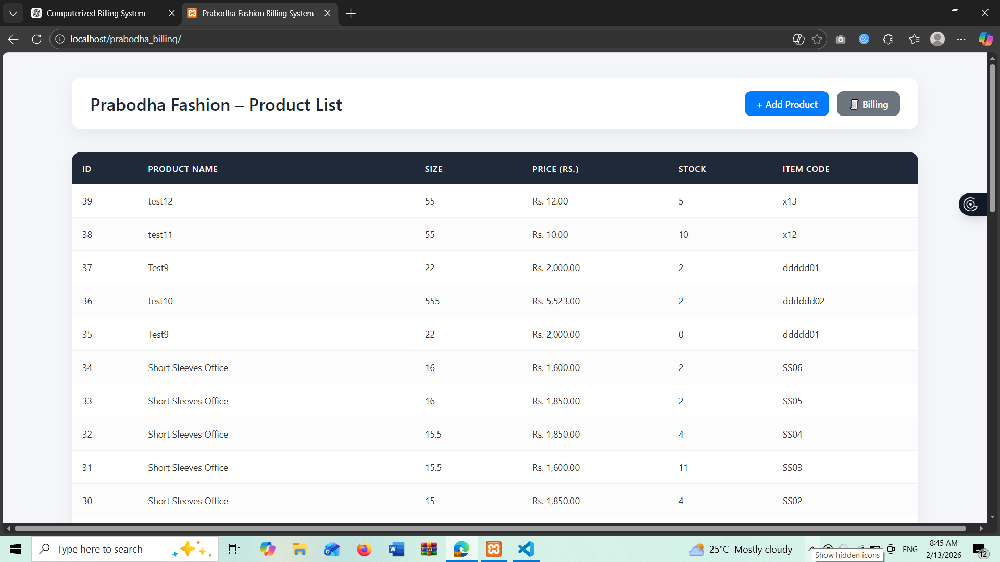
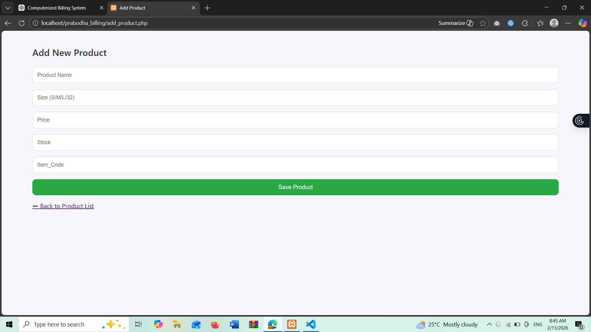

# 🧾 Prabodha Billing System

A modern computerized billing and inventory management system for a clothing store, built using **Core PHP** and **MySQL**.

This project simulates a real-world retail billing environment where products are managed using unique item codes, stock is tracked automatically, and invoices are generated dynamically.

---

## 🚀 Features

### 📦 Product Management
- Add new products
- Unique Item Code support
- Update stock quantities
- Product listing with formatted pricing
- Inventory tracking

### 🧾 Billing System
- Search products using Item Code
- Add multiple products to cart
- Live invoice summary
- Automatic stock validation
- Prevent over-selling beyond available stock
- Save & Complete Bill
- Automatic stock deduction after sale
- Clear current bill option

### 🔐 System
- Session-based cart system
- Form validation
- MySQL database integration
- Git version control

---

## 🛠 Technologies Used

- PHP (Core PHP)
- MySQL
- HTML5
- CSS3
- XAMPP (Local Server)
- Git & GitHub

---

## 📸 Screenshots

### 🛍 Product List Page

### ➕ Add Product Page

### 🧾 Billing Page

---

## 🗄 Database Structure

### Database Name:
prabodha_billing

### Tables Used:

#### 1️⃣ products

| Column    | Type                          |
|-----------|------------------------------|
| id        | INT (Primary Key, Auto Increment) |
| itemCode  | VARCHAR(50)                  |
| name      | VARCHAR(100)                 |
| size      | VARCHAR(50)                  |
| price     | DECIMAL(10,2)                |
| stock     | INT                          |

#### 2️⃣ bills

| Column       | Type |
|-------------|------|
| id          | INT (Primary Key, Auto Increment) |
| total_amount| DECIMAL(10,2) |
| created_at  | TIMESTAMP |

#### 3️⃣ bill_items

| Column     | Type |
|------------|------|
| id         | INT (Primary Key, Auto Increment) |
| bill_id    | INT |
| product_id | INT |
| quantity   | INT |
| subtotal   | DECIMAL(10,2) |

---

## 💻 How to Run the Project

1. Install **XAMPP**
2. Start **Apache** and **MySQL**
3. Open phpMyAdmin
4. Create a database named: prabodha_billing

5. Create required tables (`products`, `bills`, `bill_items`)
6. Place the project folder inside:xampp/htdocs/

---

## 🔮 Future Improvements

- Print-ready invoice design
- Sales report dashboard
- Admin login system
- Barcode scanner integration
- Responsive mobile optimization
- PDF invoice export
- Analytics dashboard

---

## 👨‍💻 Author

**Adeesha Sandamin**

GitHub:  
https://github.com/AdeeshaSandamin

---

## 🎯 Project Purpose

This project demonstrates:

- Backend development using PHP
- Relational database design
- Session management
- Stock validation logic
- Real-world retail billing logic
- Git workflow and version control discipline

---

> This project reflects practical system design skills and real-world problem-solving in retail software development.

